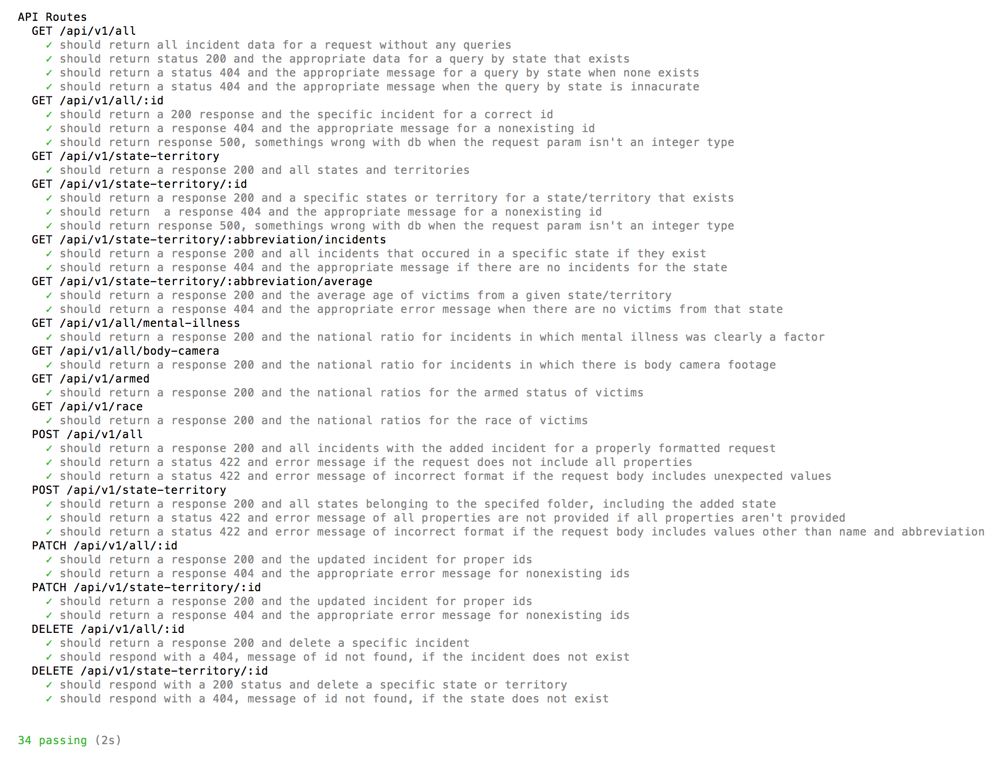

# BYOB

## An API for Fatal Police Shooting Data

### Data From the Washington Post
* last updated 3/20/2017
[Link to original data source](https://github.com/washingtonpost/data-police-shootings)

## Overview
Thus far, this is a simple restful API which largely conforms to the JSON API standard. The server is built on node-express, and connects to a postgres db via knex. Endpoints are tested using Mocha Chai.  There are two tables, one for all of the data provided from the Washington post and one for states.  All endpoints respond with appropriate status codes and JSON.  For this version, the api does not use pagination or contain data as a top level header, which the standard calls for.  Byob is so limited in its scope at this time, that it isn't cost/time effective to meet these requirements.

## Endpoints
[heroku](https://fatal-police-shootings.herokuapp.com/)
*There is no information at the base route, you must go to a specific endpoint to see any data.
*All successful calls return a status 200.

*****

### /api/v1/all

#### GET will return all of the incidents of fatal police shootings documented by WashPo as of 3/20/17.
* It does accept a query by state/territory abbreviation, For example: ?state=GA will return all of the incidents that have occurred in GA.
* It will return a 404 and an appropriate message if there are no incidents for that state or if the state abbreviation is misspelled.

#### POST will return all incidents, including the one that was added.

* It will respond with status 422 and an error message if the request body does not include all properties or contains unexpected values.

### /api/v1/state-territory

#### GET will return all states and territories.

#### POST will return all states and territories, including the one that was added.

* It will respond with status 422 and an error message if the request body does not include all properties or contains unexpected values.

### /api/v1/all/:id

#### GET will return a specific incident by its id.

* It will respond with a status 404 and an error message if there is no incident by that id number.

#### PATCH will return the updated incident.

* It will respond with status 404 and an error message if there is no incident by that id number.

#### DELETE will delete the incident.

* It will respond with status 404 and an error message if there is no incident by that id number.

### /api/v1/state-territory/:id

#### GET will return a specific state/territory by its id.

* It will respond with a status 404 and an error message if there is no state/territory by that id number.

#### PATCH will return the updated state/territory.

* It will respond with status 404 and an error message if there is no state/territory by that id number.

#### DELETE will delete the state/territory.

* It will respond with status 404 and an error message if there is no state/territory by that id number.

### /api/v1/all/state-territory/:abbreviation/incidents

#### GET will return all incidents for a specific state/territory.

* It will respond with a 404 if there are no incidents for that state or the abbreviation is incorrect.  

### /api/v1/all/state-territory/:abbreviation/average

#### GET will return the average age of all victims from a given state.

* It will respond with a 404 if there are no incidents for that state or the abbreviation is incorrect.  

### /api/v1/all/mental-illness

#### GET will return the national ratio for which mental-illness was clearly a factor.

### /api/v1/all/body-camera

#### GET will return the national ratio for which there is body camera footage.

### /api/v1/all/armed

#### GET will return the national ratios of armed statuses for the victims (including unarmed).

### /api/v1/race

#### Get will return the national ratios of victims by race
(W: White, non-Hispanic
B: Black, non-Hispanic
A: Asian
N: Native American
H: Hispanic
O: Other
U: unknown)

## Testing

